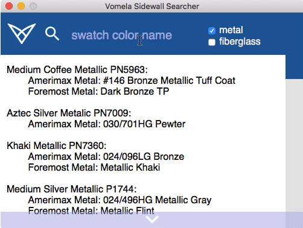

# Vomela Sidewall Searcher

A tool created for work. Search sidewall and vinyl color matches. Built with Golang

I have no NDAs for tools like this so I decided to upload these tools to github both version control, self reference and for anyone who might be interested to look at them. 

This tool is built with my fork of [webview](https://github.com/phillvancejr/webview) which contains some additional features. This project features:
   - Golang
   - Simple ui Design via html, css & js
   - A simple Go server to serve the Ui content

## Why Go?
Originally all my tools for Vomela were written in Python which offered great library support and fast iteration at the cost of some start up speed and difficult distribution. Pyinstaller was initially a satisfactory solution, however when Python2 was deprecated in 2020 on Mac OS, all of my existing tools broke and my co-workers using them could no longer use them.  
&nbsp;&nbsp;&nbsp;&nbsp;So I decided to switch to C++ for easier distribution and speed. I also switched from Tkinter to [webview](https://github.com) for the ui which allowed much more flexibility, however writing a server in C++ to serve the content was a bit of a pain. There is an awesome little C++ server called [served](https://github.com/meltwater/served) that I used at first, but it is no longer updated and I just figured there might be something simpler for these small tools. This led me to Go, which I had toyed with before. Go provided the standard library support of Python with the easy distribution of C++ and speed which was acceptable. Futher, Go's easy integration with embeded C and Objective-C mean that I can directly work with the Mac Osascript Objective-C api to do the automation I was doing with Python's old and unsupported [appscript](http://appscript.sourceforge.net/py-appscript/index.html) module.  
&nbsp;&nbsp;&nbsp;&nbsp;Go has definitely proven useful and will become my primary language for building/porting these small tools.

## Updating sidewall.json
sidewall.json in the sidewall_data folder functions as the database for color matches. The original data is stored in several csv files in the same folder which are used to create sidewall.json with go generate. After modifying any csv file make sure to run go generate to update sidewall.json